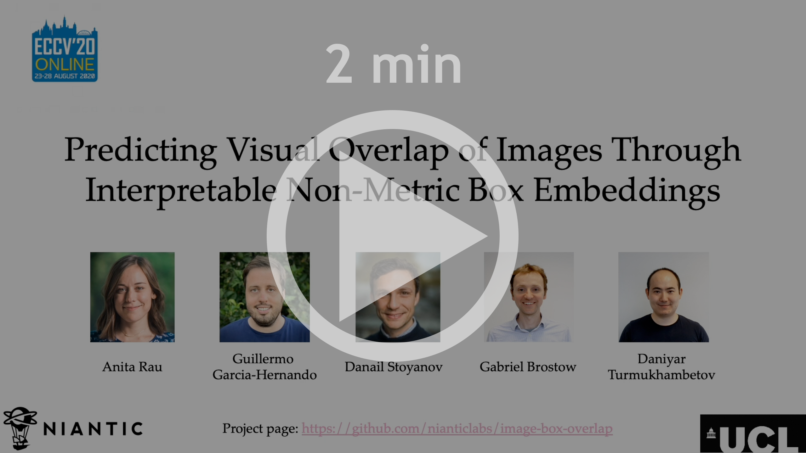
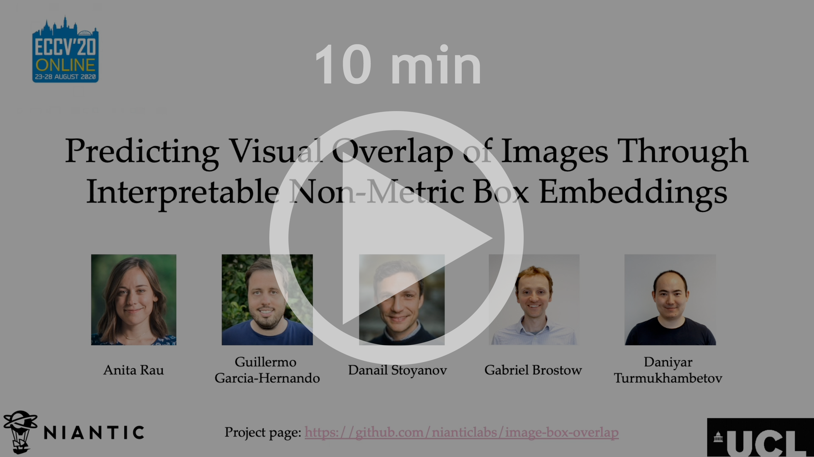
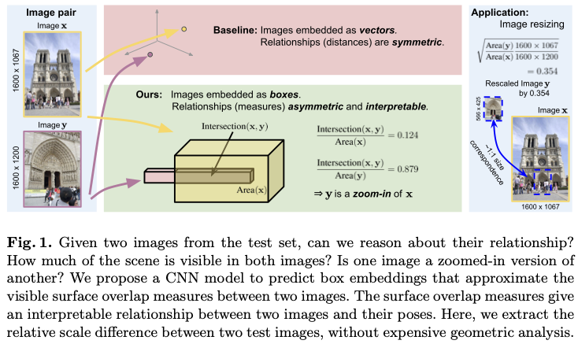
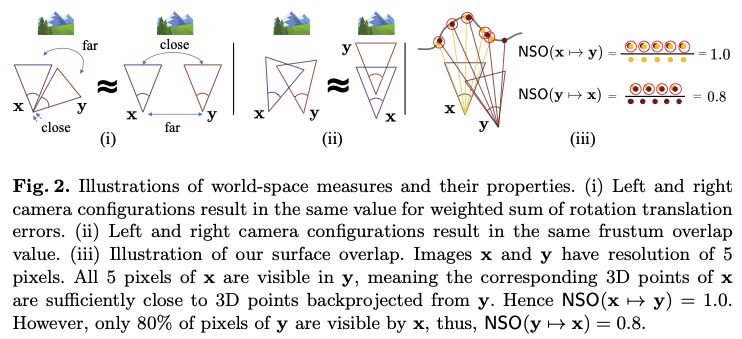
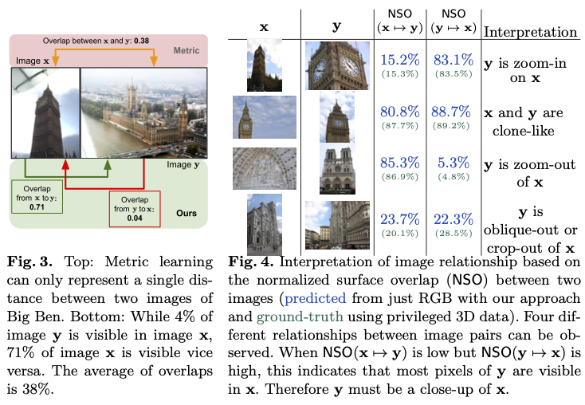
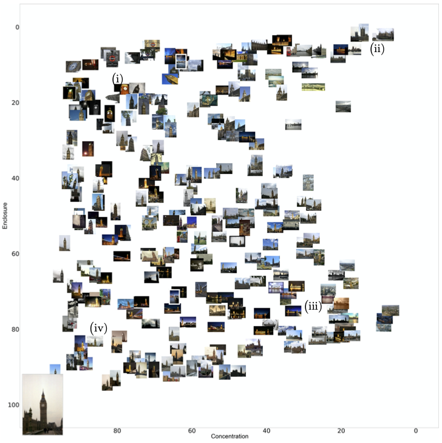
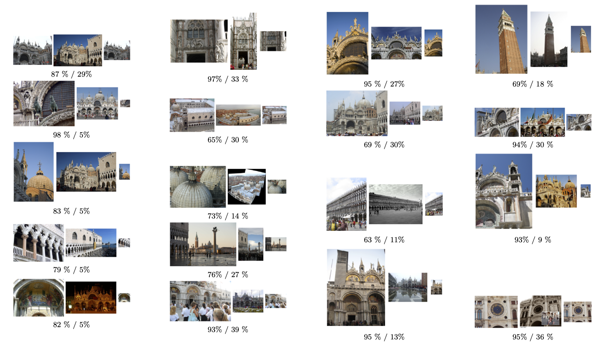
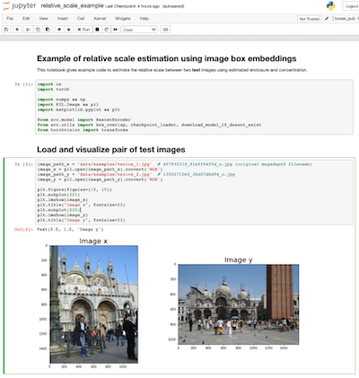

# [Predicting Visual Overlap of Images Through Interpretable Non-Metric Box Embeddings](https://arxiv.org/abs/2008.05785)

**[Anita Rau](https://anitarau.github.io), [Guillermo Garcia-Hernando](https://guiggh.github.io/), [Danail Stoyanov](https://scholar.google.co.uk/citations?user=pGfEK6UAAAAJ&hl=en), [Gabriel J. Brostow](http://www0.cs.ucl.ac.uk/staff/g.brostow/) and [Daniyar Turmukhambetov](http://dantkz.github.io/about)  – ECCV 2020 (Spotlight presentation)**

[Supplementary pdf](https://storage.googleapis.com/niantic-lon-static/research/image-box-overlap/Predicting_Visual_Overlap_Supplement.pdf)  

<p align="center">
  <a href="https://storage.googleapis.com/niantic-lon-static/research/image-box-overlap/short-video.mp4">
  
  </a>
</p>


<p align="center">
  <a href="https://storage.googleapis.com/niantic-lon-static/research/image-box-overlap/long-video.mp4">
  
  </a>
</p>

<p align="center">
  
</p>

To what extent are two images picturing the same 3D surfaces? Even when this is a known scene, the answer typically
requires an expensive search across scale space, with matching and geometric verification of large sets of
local features. This expense is further multiplied when a query image is evaluated against
a gallery, e.g. in visual relocalization. While we don’t obviate the need for geometric
verification, we propose an interpretable image-embedding that cuts the search in scale space to essentially a lookup.

Neural networks can be trained to predict a vector representations for images, such that the relative camera position between
pairs of images is approximated by a distance in vector space. And there are a few versions of such relations, that 
unfortunately are not interpretable.
<p align="center">
  
</p>


We propose to capture camera position relations through normalized surface overlap (NSO). 
NSO measure is not symmetric, but it is interpretable.
<p align="center">
  
</p>

We propose to represent images as boxes, not vectors. Two boxes can intersect, and boxes can have different volumes.
The ratio of intersection over volume can be used to approximate normalized surface overlap. So, box representation
allows us to model non-symmetric (non-metric) relations between pairs of images. The result is that with box embeddings
we can quickly identify, for example, which test image is a close-up version of another.

Next we plot the predicted NSO relationship between a test query image and a set of test images. We say "enclosure" for NSO of query pixels visible in the retrieved image, and concentration for NSO of retrieved image pixels visible in the query image.
<p align="center">
  
</p>
In the figure above, we show a query image from the test set (lower left corner) and the concentration and enclosure between randomly sampled test images from the same scene. The query image shows Big Ben from the view of the Westminster Bridge. (i) It can be observed that close-ups on the tower clock are clustered around the coordinates (80, 15). (ii) The images in the upper right corner show the waterfront side of Westminster Palace. These are crop-outs of the query image. In fact, the tower in the lower left corner of the query is one of the two towers that mark the corners of the water-front side of the palace. The retrievals in the upper right quadrant of the cluster therefore extends the view of the query. (iii) The images in the lower right area of the cluster clearly show zoom outs, with the pointy bell tower visible in all images. (iv) Lastly, one can observe that the images in the clone-like category are in fact similar views on Big Ben.


Finally, the predicted normalized surface overlap can be used to derive relative scale factor between a pair of images.

<p align="center">
  
</p>
Figure above illustrates several examples of how our method can estimate geometric relationships between images. For each pair the enclosure and concentration are calculated from which the relative estimated scaled can be derived. Based on that scale, the first image is resized and shown in the third position. The resized images match the scale of the scene in the first image to the scale in the second image. The two numbers below each image pair show the estimated enclosure and concentration. Note that although some scale estimates are inaccurate, overwhelmingly the rescaling does not increase the scale difference between the two images, but only reduces it.

Subsequently, local features need only be detected at that scale. We validate our scene-specific
model by showing how this embedding yields competitive image-matching results, while being simpler, faster,
and also interpretable by humans.

## ⚙ Setup

This codebase is a minimal implementation of the training data generation and the training function using [PyTorch Lightning](https://github.com/PyTorchLightning/pytorch-lightning).
A minimal working [Anaconda](https://www.anaconda.com/products/individual) environment is provided with the codebase: [environment.yml](environment.yml).
You can install and activate a new conda environment from this file with:

```bash
conda env create -f environment.yml -n boxes
conda activate boxes
```

## 💾 MegaDepth data and splits

To run the provided scripts the [MegaDepth](https://research.cs.cornell.edu/megadepth/) dataset needs to be downloaded.
Once downloaded, update the fields `path_sfm` and `path_depth` with the correct paths of you machine in (each of) the dataset files on 
`data/dataset_jsons/megadepth/<scene name>`.

We provide training, validation and test splits for the image overlap prediction task on four scenes: Big Ben, Notre Dame
Venice and Florence. You can find them on the folders 
`data/overlap_data/megadepth/<scene name>/`. Each file (`train.txt`, `val.txt` and `test.txt`) contains the filenames of 
pairs of images and their computed ground-truth overlap. 

If you wish to generate this date yourself, check the next section.

## 🌍 Generating normalized surface overlap datasets

Code to generate normalized surface overlaps between pairs of MegaDepth images can be found in the Python package
 `src/datasets/dataset_generator`. The package has two main components i)`compute_normals.py` and ii)`compute_overlap.py`.
 
 i. `compute_normals.py` computes the surface normals using available depth images. The list of available for each scene 
 depth images  can be found  in `data/overlap_data/megadepth/<scene name>/images_with_depth`. Don't forget to update the
 json paths as described above. 
 ii.  `compute_overlap.py` computes the normalized surface overlap between image pairs given the surface normals from 
 the previous step. 
 
 For convenience we provide an example bash script in `generate_dataset.sh`. NOTE: Normal data is stored uncompressed and
 it is about `50MB` per image in average, so storage size requirement can easily escalate.


## ⏳ Training

To train a model run:
```
python -m src.train \
--name my_box_model \
--dataset_json data/dataset_jsons/megadepth/bigben.json \
--box_ndim 32 \
--batch_size 32 \
--model resnet50 \
--num_gpus 1 \
--backend dp 
```

where `box_ndim` are the dimensions of the embedding space.  `backend` is the PyTorch Lightning [distributed backend](https://pytorch-lightning.readthedocs.io/en/latest/multi_gpu.html#data-parallel) which is flexible (we have only tested this implementation on `dp` and `ddp`) and can be used with different `num_gpus`. 
We also provide a training bash script `train.sh`. By default tensorboard logs and models are saved on a folder with the same name as the experiment `/<name>`. 

## 📊 MegaDepth evaluation

To evaluate model on surface overlap prediction and reproduce the results on the paper (Table 1) you can run:
```
python -m src.test \
--model_scene bigben \
--model resnet50 \
--dataset_json data/dataset_jsons/megadepth/bigben.json
```

or, alternatively, run the bash script provided `test.sh`.

## 🖼️ Estimating relative scale between two images estimation

For an interactive example using our models to predict the relative scale of two images you can run the following [Jupyter
 Notebook](https://jupyter.org/) `relative_scale_example.ipynb`.
 
 <p align="center">
  
</p>

## 📦 Trained models on MegaDepth
| Scene | Input size and model  | filesize | Link                                                                             |
|-------------------|-------------|-----------------|-----------------------------------------------------------------------------------------------|
| Big Ben              | 256 x 456 ResNet50  | 95 MB          | [Download 🔗](https://storage.googleapis.com/niantic-lon-static/research/image-box-overlap/models/megadepth/bigben.zip)           |
| Notre Dame           | 256 x 456 ResNet50  | 95 MB          | [Download 🔗](https://storage.googleapis.com/niantic-lon-static/research/image-box-overlap/models/megadepth/notredame.zip)         |
| Venice    | 256 x 456 ResNet50  | 95 MB          | [Download 🔗](https://storage.googleapis.com/niantic-lon-static/research/image-box-overlap/models/megadepth/venice.zip)  |
| Florence              | 256 x 456 ResNet50| 95 MB          | [Download 🔗](https://storage.googleapis.com/niantic-lon-static/research/image-box-overlap/models/megadepth/florence.zip)          |

## ✏️ 📄 Citation

If you find our work useful or interesting, please consider citing [our paper](https://arxiv.org/abs/2008.05785):

```
@inproceedings{rau-2020-image-box-overlap,
 title   = {Predicting Visual Overlap of Images Through Interpretable Non-Metric Box Embeddings},
 author  = {Anita Rau and
            Guillermo Garcia-Hernando and
            Danail Stoyanov and
            Gabriel J. Brostow and
            Daniyar Turmukhambetov
           },
 booktitle = {European Conference on Computer Vision ({ECCV})},
 year = {2020}
}
```


# 👩‍⚖️ License
Copyright © Niantic, Inc. 2020. Patent Pending. All rights reserved. Please see the license file for terms.
